# 📊 EAP — Estrutura Analítica do Projeto

---

## 📌 Identificação

| Campo | Informação |
|---|---|
| **Projeto** | FieldOps — Plataforma de Inspeção em Campo |
| **Gerente do projeto** | Natália |
| **Data** | 28/08/2026 |
| **Versão** | 1.0 |

---

## 🧩 Estrutura Analítica do Projeto

```text
FIELDOPS — PLATAFORMA DE INSPEÇÃO EM CAMPO
│
├── 1. GESTÃO E PLANEJAMENTO DO PROJETO
│   ├── 1.1 Documentação do projeto produzida
│   ├── 1.2 Escopo e backlog definidos
│   └── 1.3 Arquitetura e modelo de dados definidos
│
├── 2. API REST (BACKEND) 
│   ├── 2.1 Autenticação e autorização implementadas
│   ├── 2.2 Cadastros de domínio implementados
│   ├── 2.3 Modelos de inspeção e versionamento implementados
│   ├── 2.4 Ciclo de vida da inspeção implementado
│   ├── 2.5 Evidências e não conformidades implementadas
│   ├── 2.6 Sincronização offline implementada
│   └── 2.7 Auditoria e documentação da API produzidas
│
├── 3. INTERFACE ADMINISTRATIVA WEB (ANGULAR)
│   ├── 3.1 Base do app e design system implementados
│   ├── 3.2 Cadastros administrativos implementados
│   ├── 3.3 Construtor de modelos de inspeção implementado
│   ├── 3.4 Agendamento e acompanhamento implementados
│   └── 3.5 Revisão e aprovação implementadas
│
├── 4. APLICATIVO MOBILE (EXPO / REACT NATIVE)
│   ├── 4.1 Base do app e design system implementados
│   ├── 4.2 Consulta e detalhes de inspeções implementados
│   ├── 4.3 Execução de checklist implementada
│   ├── 4.4 Evidências, QR Code e geolocalização implementados
│   └── 4.5 Armazenamento offline e sincronização implementados
│
├── 5. INFRAESTRUTURA E NUVEM
│   ├── 5.1 Ambientes e banco de dados provisionados
│   ├── 5.2 Armazenamento de evidências configurado
│   └── 5.3 Pipeline de implantação configurado
│
└── 6. QUALIDADE E ENTREGA
    ├── 6.1 Sistema testado
    ├── 6.2 Sistema implantado
    └── 6.3 Protótipo e apresentação entregues
```

---

## 🗺️ Diagrama da EAP (Mermaid)

```mermaid
flowchart TB
    P["FIELDOPS<br/>Plataforma de Inspeção em Campo"]

    G1["1. Gestão e<br/>Planejamento"]
    G2["2. API REST<br/>(Backend)"]
    G3["3. Interface<br/>Administrativa Web"]
    G4["4. Aplicativo<br/>Mobile"]
    G5["5. Infraestrutura<br/>e Nuvem"]
    G6["6. Qualidade<br/>e Entrega"]

    P --> G1
    P --> G2
    P --> G3
    P --> G4
    P --> G5
    P --> G6

    G1 --> G1_1["1.1 Documentação<br/>produzida"]
    G1 --> G1_2["1.2 Escopo e<br/>backlog definidos"]
    G1 --> G1_3["1.3 Arquitetura e<br/>modelo de dados"]

    G2 --> G2_1["2.1 Autenticação e<br/>autorização"]
    G2 --> G2_2["2.2 Cadastros de<br/>domínio"]
    G2 --> G2_3["2.3 Modelos e<br/>versionamento"]
    G2 --> G2_4["2.4 Ciclo de vida<br/>da inspeção"]
    G2 --> G2_5["2.5 Evidências e<br/>não conformidades"]
    G2 --> G2_6["2.6 Sincronização<br/>offline"]
    G2 --> G2_7["2.7 Auditoria e<br/>documentação da API"]

    G3 --> G3_1["3.1 Base e<br/>design system"]
    G3 --> G3_2["3.2 Cadastros<br/>administrativos"]
    G3 --> G3_3["3.3 Construtor de<br/>modelos"]
    G3 --> G3_4["3.4 Agendamento e<br/>acompanhamento"]
    G3 --> G3_5["3.5 Revisão e<br/>aprovação"]

    G4 --> G4_1["4.1 Base e<br/>design system"]
    G4 --> G4_2["4.2 Consulta e<br/>detalhes"]
    G4 --> G4_3["4.3 Execução de<br/>checklist"]
    G4 --> G4_4["4.4 Evidências, QR<br/>Code e localização"]
    G4 --> G4_5["4.5 Offline e<br/>sincronização"]

    G5 --> G5_1["5.1 Ambientes e<br/>banco de dados"]
    G5 --> G5_2["5.2 Armazenamento<br/>de evidências"]
    G5 --> G5_3["5.3 Pipeline de<br/>implantação"]

    G6 --> G6_1["6.1 Sistema<br/>testado"]
    G6 --> G6_2["6.2 Sistema<br/>implantado"]
    G6 --> G6_3["6.3 Protótipo e<br/>apresentação"]

    classDef projeto fill:#0F766E,stroke:#0F766E,color:#fff,font-weight:bold;
    classDef entrega fill:#14B8A6,stroke:#0F766E,color:#fff;
    classDef pacote fill:#FFFFFF,stroke:#14B8A6,color:#1E293B;

    class P projeto;
    class G1,G2,G3,G4,G5,G6 entrega;
    class G1_1,G1_2,G1_3,G2_1,G2_2,G2_3,G2_4,G2_5,G2_6,G2_7,G3_1,G3_2,G3_3,G3_4,G3_5,G4_1,G4_2,G4_3,G4_4,G4_5,G5_1,G5_2,G5_3,G6_1,G6_2,G6_3 pacote;
```



---

## 📋 Dicionário da EAP

| Código | Elemento | Descrição |
|---|---|---|
| 1.0 | Gestão e Planejamento do Projeto | Definição e organização do escopo, documentação e decisões estruturais do projeto |
| 1.1 | Documentação do projeto produzida | Conjunto de documentos (visão, objetivos, personas, casos de uso, regras de negócio) organizados e revisados |
| 1.2 | Escopo e backlog definidos | Escopo do MVP delimitado e backlog do produto com histórias e critérios de aceitação |
| 1.3 | Arquitetura e modelo de dados definidos | Decisões arquiteturais, diagrama de componentes e modelo de dados (entidades e relacionamentos) documentados |
| 2.0 | API REST (Backend) | Serviço central em Java + Spring Boot com as regras de negócio e persistência |
| 2.1 | Autenticação e autorização implementadas | Login por JWT e controle de acesso por perfil (Técnico, Supervisor, Administrador) |
| 2.2 | Cadastros de domínio implementados | Endpoints de clientes, locais, equipamentos e usuários persistidos em PostgreSQL |
| 2.3 | Modelos de inspeção e versionamento implementados | Criação, publicação e versionamento de modelos de inspeção com seções e itens |
| 2.4 | Ciclo de vida da inspeção implementado | Agendamento, atribuição, execução, envio e transições de estado da inspeção |
| 2.5 | Evidências e não conformidades implementadas | Upload/consulta de fotos vinculadas a itens e registro de não conformidades |
| 2.6 | Sincronização offline implementada | Operações idempotentes para receber e conciliar dados enviados pelo mobile |
| 2.7 | Auditoria e documentação da API produzidas | Registro de auditoria de eventos e documentação OpenAPI/Swagger publicada |
| 3.0 | Interface Administrativa Web (Angular) | Aplicação web para supervisores e administradores |
| 3.1 | Base do app e design system implementados | Estrutura do projeto Angular, roteamento, layout e componentes reutilizáveis com o design system aplicado |
| 3.2 | Cadastros administrativos implementados | Telas de usuários, clientes, locais e equipamentos integradas à API |
| 3.3 | Construtor de modelos de inspeção implementado | Editor de modelos com seções, itens, tipos de resposta e validação de publicação |
| 3.4 | Agendamento e acompanhamento implementados | Telas de agendamento de inspeções, listagem, filtros e dashboard de acompanhamento |
| 3.5 | Revisão e aprovação implementadas | Tela de revisão de respostas e evidências com aprovação, reprovação e não conformidades |
| 4.0 | Aplicativo Mobile (Expo / React Native) | Aplicativo para técnicos de campo, com suporte offline |
| 4.1 | Base do app e design system implementados | Estrutura do projeto Expo, navegação, autenticação e componentes reutilizáveis |
| 4.2 | Consulta e detalhes de inspeções implementados | Telas de início, lista e detalhes das inspeções atribuídas ao técnico |
| 4.3 | Execução de checklist implementada | Checklist dinâmico com todos os tipos de resposta, salvamento local e regras de obrigatoriedade |
| 4.4 | Evidências, QR Code e geolocalização implementados | Captura de fotos, leitura de QR Code de equipamentos e registro de localização |
| 4.5 | Armazenamento offline e sincronização implementados | Persistência local em SQLite e sincronização automática ao reconectar |
| 5.0 | Infraestrutura e Nuvem | Ambientes, serviços e recursos que sustentam a solução |
| 5.1 | Ambientes e banco de dados provisionados | Ambientes configurados e banco PostgreSQL provisionado |
| 5.2 | Armazenamento de evidências configurado | Serviço de armazenamento de objetos para fotos disponibilizado |
| 5.3 | Pipeline de implantação configurado | Build, containerização e implantação automatizados |
| 6.0 | Qualidade e Entrega | Verificação, disponibilização e demonstração da solução |
| 6.1 | Sistema testado | Testes de funcionalidades e de integração entre os componentes concluídos |
| 6.2 | Sistema implantado | Solução disponibilizada nos ambientes de destino |
| 6.3 | Protótipo e apresentação entregues | Protótipo navegável e apresentação do fluxo completo do MVP prontos |