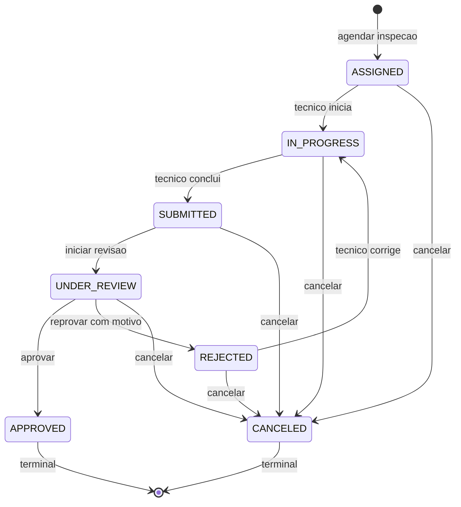

# FieldOps API — Diagramas (PBI-071)

Complementa o OpenAPI/Swagger UI (`/swagger-ui.html`) com os dois diagramas pedidos:
o modelo de entidades e a máquina de estados da inspeção. Os diagramas usam
[Mermaid](https://mermaid.js.org/) e são renderizados diretamente pelo GitHub.

## Como abrir o Swagger UI

Com a API em execução (perfil `dev`):

- Swagger UI: `http://localhost:8080/swagger-ui.html`
- Documento OpenAPI (JSON): `http://localhost:8080/v3/api-docs`

Todos os endpoints (auth, usuários, clientes, locais, equipamentos, modelos de inspeção,
inspeções admin, revisão/decisão, mobile e sync) estão documentados com seus grupos (`@Tag`),
respostas (`@ApiResponse`) e o esquema de autenticação Bearer JWT. O Swagger UI gera exemplos
de request/response automaticamente a partir dos DTOs.

## Diagrama de entidades

```mermaid
erDiagram
    USER ||--o{ REFRESH_TOKEN : possui
    USER ||--o{ INSPECTION : atua_em
    USER ||--o{ INSPECTION_TEMPLATE : cria
    USER ||--o{ INSPECTION_TEMPLATE_VERSION : publica

    CLIENT ||--o{ INSPECTION_SITE : possui
    INSPECTION_SITE ||--o{ EQUIPMENT : abriga

    INSPECTION_TEMPLATE ||--o{ TEMPLATE_SECTION : contem
    TEMPLATE_SECTION ||--o{ TEMPLATE_ITEM : contem
    INSPECTION_TEMPLATE ||--o{ INSPECTION_TEMPLATE_VERSION : versiona

    INSPECTION_TEMPLATE_VERSION ||--o{ INSPECTION : origina
    INSPECTION ||--o{ INSPECTION_ITEM_SNAPSHOT : congela

    INSPECTION ||--o{ AUDIT_EVENT : registra
    INSPECTION ||--o{ PROCESSED_OPERATION : idempotencia

    USER {
        bigint id PK
        string email UK
        string role "ADMINISTRATOR, SUPERVISOR, TECHNICIAN"
        string status "ACTIVE, INACTIVE, BLOCKED"
    }
    CLIENT {
        bigint id PK
        string name
        string document UK
        string status "ACTIVE, INACTIVE"
    }
    INSPECTION_SITE {
        bigint id PK
        bigint client_id FK
        string name
        string status "ACTIVE, INACTIVE"
    }
    EQUIPMENT {
        bigint id PK
        bigint site_id FK
        string name
        string qr_code UK
        string status "ACTIVE, INACTIVE, DECOMMISSIONED"
    }
    INSPECTION_TEMPLATE {
        bigint id PK
        string title
        string category
        string status "DRAFT, ACTIVE, INACTIVE"
        int current_version
    }
    TEMPLATE_SECTION {
        bigint id PK
        bigint template_id FK
        string title
        int display_order
    }
    TEMPLATE_ITEM {
        bigint id PK
        bigint section_id FK
        string question
        string response_type "TEXT, NUMBER, BOOLEAN, CONFORMITY, SINGLE_CHOICE, DATE"
        boolean required
    }
    INSPECTION_TEMPLATE_VERSION {
        bigint id PK
        bigint template_id FK
        int version_number
        bigint published_by FK
        timestamp published_at
    }
    INSPECTION {
        bigint id PK
        bigint template_version_id FK
        bigint technician_id FK
        bigint supervisor_id FK
        string status "ASSIGNED, IN_PROGRESS, SUBMITTED, UNDER_REVIEW, APPROVED, REJECTED, CANCELED"
        string priority "LOW, MEDIUM, HIGH, CRITICAL"
        date due_date
        timestamp reviewed_at
        timestamp canceled_at
    }
    INSPECTION_ITEM_SNAPSHOT {
        bigint id PK
        bigint inspection_id FK
        string item_title
        string response_type
    }
    AUDIT_EVENT {
        bigint id PK
        bigint actor_id FK
        string action
        string entity_type
        bigint entity_id
        timestamp occurred_at
    }
    PROCESSED_OPERATION {
        uuid operation_id PK
        string operation_type
        bigint entity_id
        timestamp processed_at
    }
    REFRESH_TOKEN {
        bigint id PK
        bigint user_id FK
        string token UK
        timestamp expires_at
    }
```

## Diagrama de estados da inspeção

Reflete a máquina de estados aplicada no backend (`InspectionStatus` + as transições em
`InspectionService` e `MobileInspectionService`). `APPROVED` e `CANCELED` são terminais.

Endpoints por transição: aprovar `POST /api/v1/inspections/{id}/approve`, reprovar
`POST /api/v1/inspections/{id}/reject`, cancelar `POST /api/v1/inspections/{id}/cancel`,
transições do técnico `POST /api/v1/mobile/inspections/{id}/status`.

### Regras aplicadas

- Cancelamento (RN-029/RN-030): permitido de `ASSIGNED`, `IN_PROGRESS`, `SUBMITTED`,
  `UNDER_REVIEW` e `REJECTED`; **bloqueado** em `APPROVED` (422). Exige motivo (mín. 10 chars).
- Aprovar/Reprovar: apenas a partir de `UNDER_REVIEW` (senão 422). Reprovar exige motivo.
- Transições do técnico no mobile (`POST /api/v1/mobile/inspections/{id}/status`) são
  idempotentes por `operationId`.
- Toda transição registra um evento imutável em `audit_events`
  (`GET /api/v1/inspections/{id}/history`).
