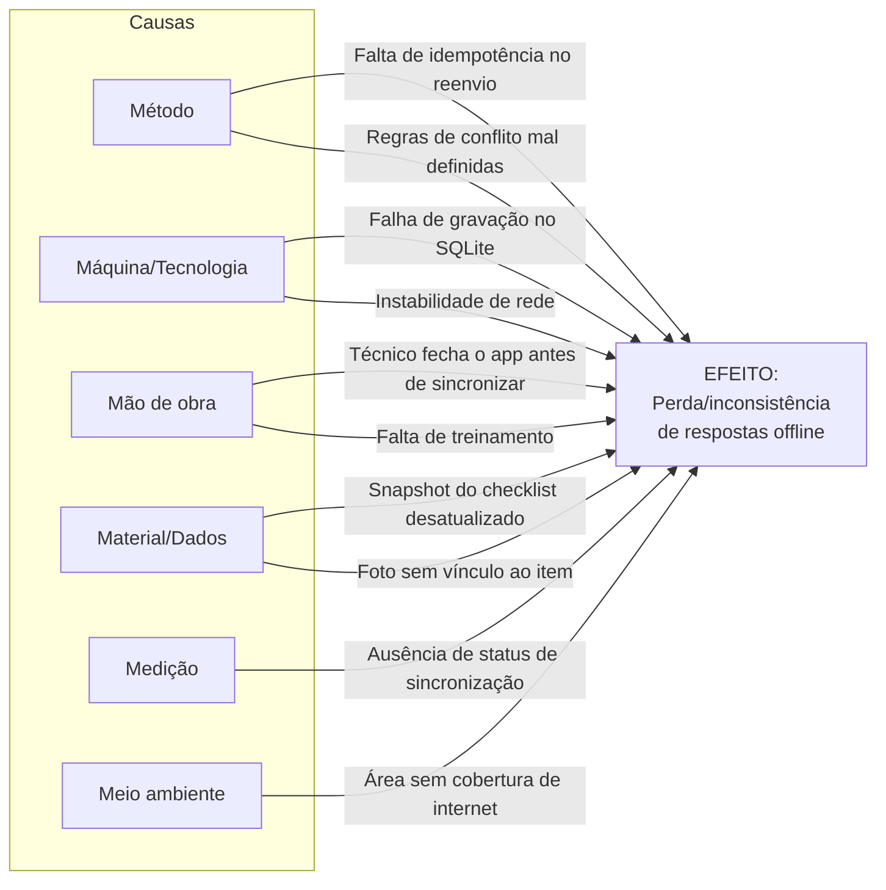
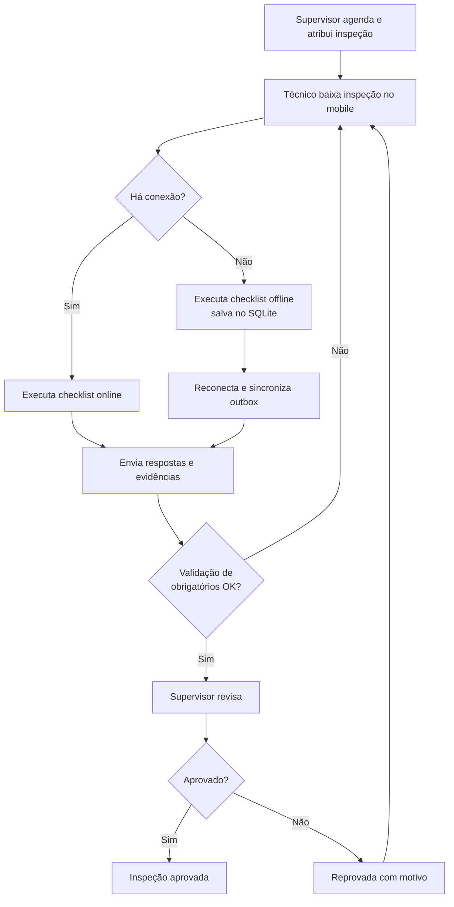
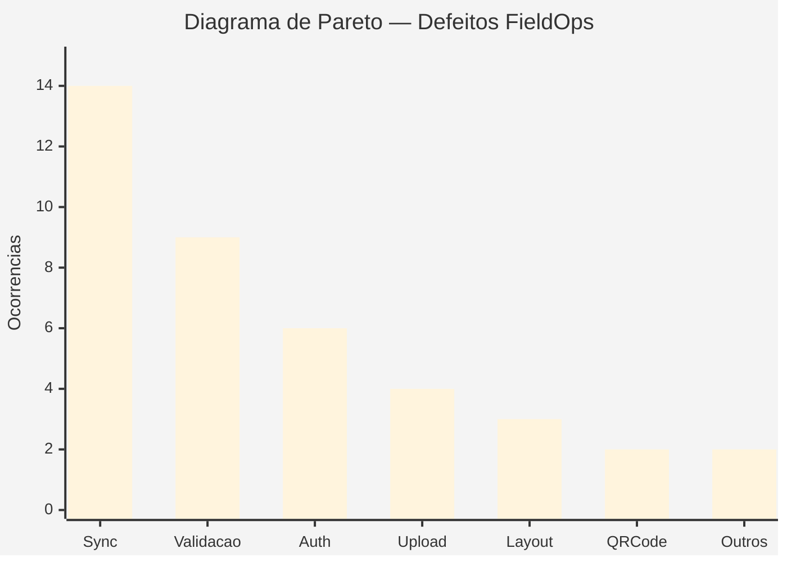
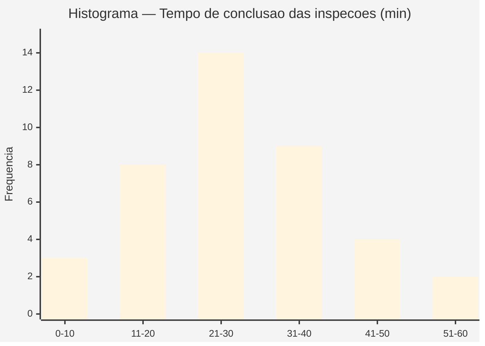
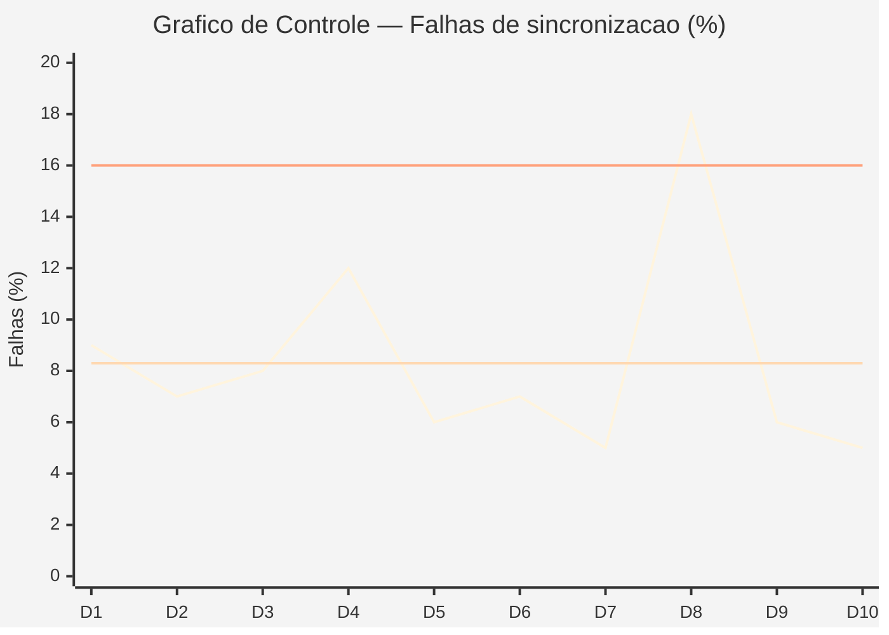
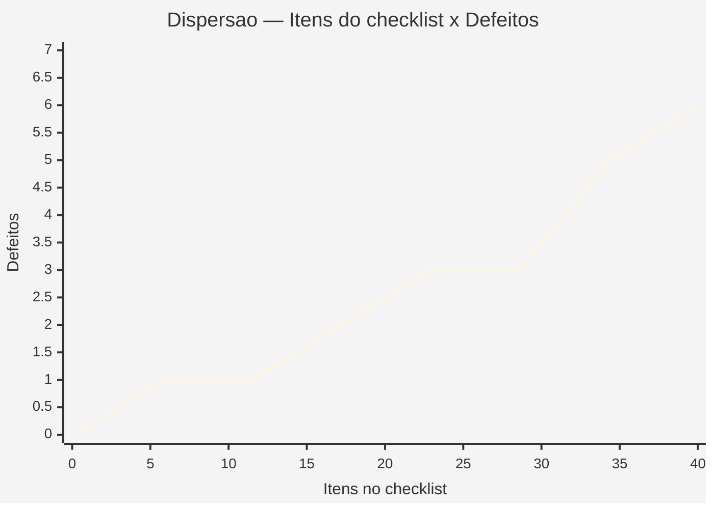

# Análise da Qualidade do Projeto — FieldOps

> **Disciplina:** Gestão de Projetos — 4º semestre ADS
> **Professor:** Me. Deivison S. Takatu
> **Aula 05:** Custos e Qualidade — Atividade de Qualidade
> **Projeto:** FieldOps — Plataforma de Inspeção em Campo
> **Equipe:** 404 Not Found
> **Data:** 04/09/2026

---

## 1. Objetivo

Este documento apresenta uma **análise da qualidade do Projeto FieldOps** aplicando as **Sete Ferramentas de Qualidade Básicas**, no contexto do processo de **Gerenciamento da Qualidade do Projeto** (PMBOK, área 8): planejar a qualidade, garantir a qualidade e controlar a qualidade.

A análise usa como base os artefatos do projeto (README, EAP, Cronograma e Backlog) e dados simulados de acompanhamento de defeitos e inspeções, com o objetivo de identificar causas de problemas, priorizar ações e monitorar o desempenho.

### O que entendemos por qualidade no FieldOps
- **Atender às necessidades do cliente:** entregar o fluxo de inspeção ponta a ponta conforme os requisitos.
- **Prevenir problemas:** evitar defeitos na origem (ex.: perda de respostas offline).
- **Buscar melhoria contínua:** aprender a cada sprint e aperfeiçoar processos.
- **Medir e acompanhar resultados:** usar indicadores para identificar desvios.

---

## 2. As Sete Ferramentas Aplicadas ao FieldOps

### 2.1 Diagrama de Causa e Efeito (Ishikawa)

**Problema analisado:** *"Perda ou inconsistência de respostas de inspeção durante o uso offline/sincronização"* — um dos riscos centrais do projeto.

**Análise:** as causas mais críticas concentram-se em **Método** (idempotência e regras de conflito) e **Máquina/Tecnologia** (persistência local e rede). São exatamente os pontos endereçados pelos PBIs 050–055 do backlog.

---

### 2.2 Fluxograma

**Processo analisado:** ciclo de vida da inspeção, do agendamento à aprovação.

**Análise:** o fluxograma evidencia dois pontos de controle de qualidade — a **validação de obrigatórios** (mobile) e a **revisão do supervisor** (web) — que atuam como barreiras de prevenção de defeitos antes da aprovação.

---

### 2.3 Folha de Verificação (Check Sheet)

**Coleta:** contagem de defeitos registrados durante os testes da Sprint 1 e início da Sprint 2 (dados simulados para análise).

| Categoria de defeito | Ocorrências | Frequência |
|---|---|---:|
| Falha de sincronização offline | ▍▍▍▍▍▍▍▍▍▍▍▍▍▍ | 14 |
| Validação de formulário/checklist | ▍▍▍▍▍▍▍▍▍ | 9 |
| Autenticação / sessão (token) | ▍▍▍▍▍▍ | 6 |
| Upload de evidências (foto) | ▍▍▍▍ | 4 |
| Layout / responsividade (web) | ▍▍▍ | 3 |
| Leitura de QR Code | ▍▍ | 2 |
| Outros | ▍▍ | 2 |
| **Total** | | **40** |

**Análise:** a folha de verificação padroniza a coleta e mostra que **falhas de sincronização** e **validações** concentram a maior parte dos defeitos.

---

### 2.4 Diagrama de Pareto

**Princípio 80/20:** identificar as poucas categorias que respondem pela maior parte dos defeitos.

| Categoria | Ocorrências | % | % Acumulado |
|---|---:|---:|---:|
| Falha de sincronização offline | 14 | 35,0% | 35,0% |
| Validação de formulário/checklist | 9 | 22,5% | 57,5% |
| Autenticação / sessão | 6 | 15,0% | 72,5% |
| Upload de evidências | 4 | 10,0% | 82,5% |
| Layout / responsividade | 3 | 7,5% | 90,0% |
| Leitura de QR Code | 2 | 5,0% | 95,0% |
| Outros | 2 | 5,0% | 100,0% |

**Análise:** as três primeiras categorias (**sincronização, validação e autenticação**) respondem por **72,5%** dos defeitos. Concentrar esforços de correção e testes nelas trará o maior ganho de qualidade.

---

### 2.5 Histograma

**Distribuição:** tempo de conclusão de inspeções (em minutos) em um lote de 40 inspeções de teste.

| Faixa (min) | Frequência |
|---|---:|
| 0–10 | 3 |
| 11–20 | 8 |
| 21–30 | 14 |
| 31–40 | 9 |
| 41–50 | 4 |
| 51–60 | 2 |

**Análise:** a distribuição é aproximadamente normal, com concentração na faixa de **21–30 minutos** por inspeção. A cauda acima de 40 min sugere casos com muitas não conformidades ou problemas de conexão, que merecem investigação.

---

### 2.6 Gráfico de Controle

**Monitoramento:** taxa de sincronizações com falha (%) por dia ao longo de 10 dias de testes.

| Dia | Falhas de sync (%) |
|---|---:|
| 1 | 9 |
| 2 | 7 |
| 3 | 8 |
| 4 | 12 |
| 5 | 6 |
| 6 | 7 |
| 7 | 5 |
| 8 | 18 |
| 9 | 6 |
| 10 | 5 |

- **Média (linha central):** ~8,3%
- **Limite Superior de Controle (LSC):** ~16%
- **Limite Inferior de Controle (LIC):** ~0%

**Análise:** o **Dia 8 (18%)** ultrapassa o LSC, indicando um ponto **fora de controle** — uma causa especial (provavelmente a instabilidade de rede/deploy daquele dia). Os demais pontos estão dentro dos limites (variação comum), mostrando um processo majoritariamente estável.

---

### 2.7 Diagrama de Dispersão

**Correlação analisada:** relação entre **número de itens no checklist** e **quantidade de defeitos** reportados por inspeção.

| Itens no checklist | Defeitos |
|---:|---:|
| 5 | 0 |
| 8 | 1 |
| 12 | 1 |
| 15 | 2 |
| 20 | 3 |
| 25 | 3 |
| 30 | 5 |
| 35 | 6 |

**Análise:** existe uma **correlação positiva** — quanto mais itens no checklist, maior a tendência de defeitos. Isso reforça a necessidade de reforçar testes e validações em modelos de inspeção grandes (muitos itens/seções).

---

## 3. Conclusões

1. **Foco de qualidade claro:** as ferramentas convergem para o mesmo ponto crítico — a **sincronização offline**, que lidera tanto a folha de verificação quanto o Pareto e gera o único ponto fora de controle.
2. **Priorização (Pareto):** atacar sincronização, validação e autenticação resolve ~72,5% dos defeitos. São as ações de maior retorno.
3. **Prevenção na origem (Ishikawa + Fluxograma):** reforçar idempotência, regras de conflito e a barreira de validação de obrigatórios previne defeitos antes da revisão.
4. **Processo majoritariamente estável (Controle):** salvo a causa especial do Dia 8, o processo opera dentro dos limites — o foco deve ser eliminar causas especiais.
5. **Complexidade x defeitos (Dispersão):** modelos de inspeção com muitos itens exigem atenção redobrada de teste.

### Ações recomendadas
- Priorizar os PBIs de **sincronização e idempotência** com testes automatizados dedicados.
- Adotar a **folha de verificação** como rotina de coleta em todas as sprints.
- Acompanhar semanalmente o **gráfico de controle** de falhas de sincronização.
- Criar testes de regressão específicos para checklists com **mais de 25 itens**.