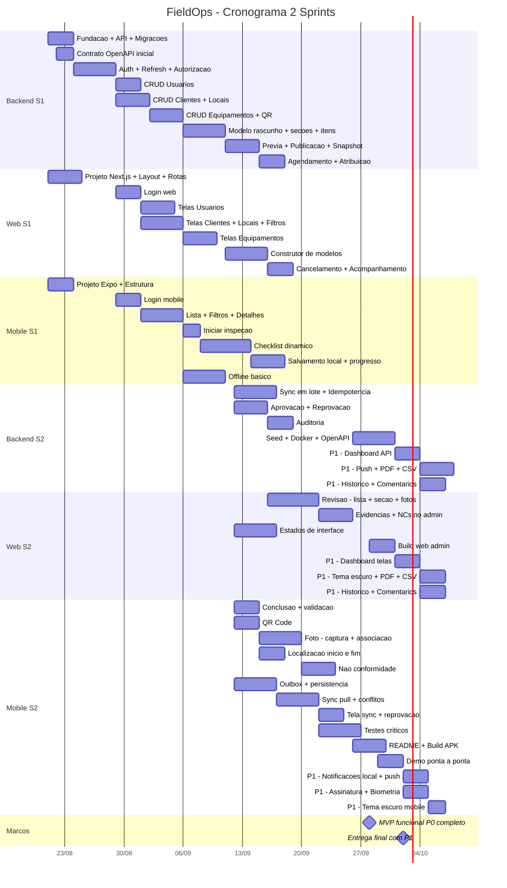

# Cronograma do Projeto — FieldOps

## Sprint 1

> Período: 14/09/2026 → 18/09/2026

### Equipe Completa

| PBI | Título |
|-----|--------|
| TAP | Termo de Abertura de Projeto |

### Backend (Lucas e Marcela)

| PBI | Título |
|-----|--------|
| PBI-001 | Repositórios e convenções definidos |
| PBI-004 | API Spring Boot conectada ao PostgreSQL com migrações |
| PBI-006 | Contrato inicial OpenAPI e dados simulados para frontends |
| PBI-007 | Autenticação por e-mail e senha na API |
| PBI-010 | Renovação automática de sessão (refresh token) |
| PBI-012 | Autorização por perfil na API |
| PBI-011 | CRUD de usuários pelo administrador |
| PBI-013 | CRUD de clientes |
| PBI-014 | CRUD de locais vinculados a clientes |
| PBI-015 | CRUD de equipamentos com QR Code único |
| PBI-016 | QR Code único por equipamento |
| PBI-017 | Pesquisa, filtros e paginação nos cadastros |
| PBI-018 | Criar modelo de inspeção em rascunho |
| PBI-019 | Criar e ordenar seções do checklist |
| PBI-020 | Criar itens com tipos de resposta |
| PBI-021 | Definir obrigatoriedade e regras de evidência |
| PBI-022 | Validação e prévia do checklist antes de publicar |
| PBI-023 | Publicar versão imutável do modelo |
| PBI-024 | Snapshot dos itens ao criar inspeção |
| PBI-025 | Agendar inspeção a partir de modelo publicado |
| PBI-027 | Atribuir inspeção a técnico ativo |
| PBI-028 | Definir prioridade, prazo e instruções na inspeção |
| PBI-029 | Cancelar inspeção com justificativa |

### Frontend Web (Andressa, Ian, Júlia e Carol)

| PBI | Título |
|-----|--------|
| PBI-001 | Repositórios e convenções definidos (participação) |
| PBI-003 | Projeto Next.js com layout, rotas protegidas e estrutura modular |
| PBI-005 | Lint, verificação de tipos e fluxo de PR |
| PBI-009 | Login e sessão na interface web |
| PBI-011 | CRUD de usuários pelo administrador (telas) |
| PBI-013 | CRUD de clientes (telas) |
| PBI-014 | CRUD de locais vinculados a clientes (telas) |
| PBI-015 | CRUD de equipamentos com QR Code único (telas) |
| PBI-017 | Pesquisa, filtros e paginação nos cadastros (telas) |
| PBI-018 | Criar modelo de inspeção em rascunho (telas) |
| PBI-019 | Criar e ordenar seções do checklist (telas) |
| PBI-020 | Criar itens com tipos de resposta (telas) |
| PBI-022 | Visualizar prévia do checklist antes de publicar |
| PBI-026 | Seleção encadeada cliente → local → equipamento |
| PBI-029 | Cancelar inspeção com justificativa (tela) |
| PBI-030 | Acompanhar inspeções em listagem com filtros |

### Mobile (Rodrigo, Natália e Cutiur)

| PBI | Título |
|-----|--------|
| PBI-001 | Repositórios e convenções definidos (participação) |
| PBI-002 | Projeto Expo com TypeScript e estrutura por features |
| PBI-008 | Login e sessão no aplicativo mobile |
| PBI-031 | Download e visualização das inspeções atribuídas |
| PBI-032 | Filtrar inspeções por estado, data e prioridade |
| PBI-033 | Detalhes da inspeção no mobile |
| PBI-034 | Iniciar inspeção com registro de horário |
| PBI-035 | Checklist dinâmico a partir do snapshot |
| PBI-036 | Componentes de resposta para cada tipo de item |
| PBI-037 | Salvar cada resposta localmente (SQLite) |
| PBI-038 | Visualizar progresso e itens pendentes |
| PBI-039 | Registrar observações em itens |
| PBI-048 | Acesso offline a inspeções baixadas |

---

## Sprint 2

> Período: 19/09/2026 → 19/09/2026  

### Backend (Lucas e Marcela)

| PBI | Título |
|-----|--------|
| PBI-051 | Envio em lote respeitando dependências |
| PBI-052 | Idempotência — impedir duplicidade no reenvio |
| PBI-060 | Aprovar inspeção |
| PBI-061 | Reprovar inspeção com motivo obrigatório |
| PBI-063 | Auditoria de mudanças de estado |
| PBI-066 | Dados de demonstração reproduzíveis (seed) |
| PBI-070 | API em contêiner Docker para demonstração |
| PBI-071 | OpenAPI completo e diagramas |
| PBI-073 | *P1:* Dashboard com indicadores por estado e criticidade (API) |
| PBI-075 | *P1:* Notificações push — integração servidor |
| PBI-077 | *P1:* Relatório PDF básico |
| PBI-078 | *P1:* Histórico detalhado de respostas |
| PBI-079 | *P1:* Comentários de revisão por item |
| PBI-082 | *P1:* Exportação CSV |

### Frontend Web (Andressa, Ian, Júlia e Carol)

| PBI | Título |
|-----|--------|
| PBI-047 | Visualizar evidências e NCs no admin |
| PBI-056 | Lista de inspeções aguardando revisão |
| PBI-057 | Revisão de respostas por seção e item |
| PBI-058 | Lightbox de fotografias na revisão |
| PBI-059 | Iniciar revisão formalmente |
| PBI-064 | Estados de carregamento, vazio, erro e offline |
| PBI-069 | Build e publicação do painel web admin |
| PBI-073 | *P1:* Dashboard com indicadores (telas) |
| PBI-077 | *P1:* Relatório PDF básico (visualização/download) |
| PBI-078 | *P1:* Histórico detalhado de respostas (telas) |
| PBI-079 | *P1:* Comentários de revisão por item (telas) |
| PBI-081 | *P1:* Tema escuro |
| PBI-082 | *P1:* Exportação CSV (botão e download) |

### Mobile (Rodrigo, Natália e Cutiur)

| PBI | Título |
|-----|--------|
| PBI-040 | Conclusão com validação de obrigatórios |
| PBI-041 | Leitura de QR Code para confirmar equipamento |
| PBI-042 | Capturar fotografia e visualizar prévia |
| PBI-043 | Associar fotografia ao item correto |
| PBI-044 | Foto pendente quando upload falha |
| PBI-045 | Registrar localização no início e conclusão |
| PBI-046 | Registrar não conformidade com criticidade |
| PBI-049 | Respostas persistem após fechar o aplicativo |
| PBI-050 | Registrar alterações na outbox persistente |
| PBI-053 | Pull de alterações com cursor de sincronização |
| PBI-054 | Tela de status de sincronização |
| PBI-055 | Detecção de conflito de versão |
| PBI-062 | Técnico recebe inspeção reprovada para correção |
| PBI-065 | Testes automatizados dos fluxos críticos |
| PBI-067 | READMEs com instruções de execução |
| PBI-068 | Build Android (APK) para demonstração |
| PBI-072 | Demonstração ponta a ponta |
| PBI-074 | *P1:* Notificações locais de prazo |
| PBI-075 | *P1:* Notificações push de nova atribuição |
| PBI-076 | *P1:* Assinatura desenhada no dispositivo |
| PBI-080 | *P1:* Biometria para reabertura de sessão local |
| PBI-081 | *P1:* Tema escuro (mobile) |

---

## Gráfico de Gantt

