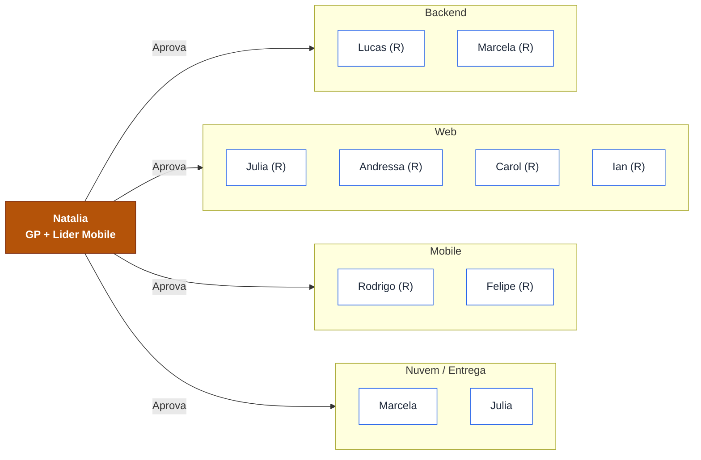

# 🧭 Matriz RACI — Projeto FieldOps

> **Projeto:** FieldOps — Plataforma de Inspeção em Campo
> **Documento:** Matriz de Responsabilidades (RACI)
> **Base:** 48 cards (PBIs) cobrindo **todas as áreas** do projeto (mínimo de 40 exigido) — `docs/cronograma.md` e backlog do repositório
> **Versão:** 1.0

---

## 1. Objetivo

A **Matriz RACI** é uma matriz de responsabilidades (MR) que mostra os recursos do projeto alocados a cada pacote de trabalho. Para cada atividade (card/PBI) definem-se os papéis:

| Sigla | Papel | Significado |
|---|---|---|
| **R** | **Responsável** | Executa a atividade (mão na massa). |
| **A** | **Aprovador** (Accountable) | Presta contas e aprova o resultado. Deve haver **apenas um A** por atividade. |
| **C** | **Consultado** | É consultado (comunicação bidirecional) por ter conhecimento relevante. |
| **I** | **Informado** | É mantido informado sobre o andamento/resultado (comunicação unidirecional). |

---

## 2. Legenda de responsáveis

| Sigla | Integrante | Papel |
|---|---|---|
| **NAT** | Natália | Gerente de Projeto + Líder Mobile |
| **LUC** | Lucas | Líder Backend |
| **MAR** | Marcela | Dev Backend + Nuvem |
| **JUL** | Júlia | Líder Web + Nuvem |
| **AND** | Andressa | Dev Web |
| **CAR** | Carol | Dev Web |
| **IAN** | Ian | Dev Web |
| **ROD** | Rodrigo | Dev Mobile |
| **FEL** | Felipe (Cutiur) | Dev Mobile |

---

## 3. Matriz RACI — 40 cards de todas as áreas

> Legenda: **R** = Responsável · **A** = Aprovador · **C** = Consultado · **I** = Informado

### 3.1 Gestão e Planejamento

| # | Card / Atividade | NAT | LUC | MAR | JUL | AND | CAR | IAN | ROD | FEL |
|---|---|:--:|:--:|:--:|:--:|:--:|:--:|:--:|:--:|:--:|
| TAP | Termo de Abertura de Projeto | A/R | C | C | C | I | I | I | I | I |
| PBI-001 | Repositórios e convenções definidos | A | R | C | R | C | C | C | C | C |

### 3.2 Backend (API REST)

| # | Card / Atividade | NAT | LUC | MAR | JUL | AND | CAR | IAN | ROD | FEL |
|---|---|:--:|:--:|:--:|:--:|:--:|:--:|:--:|:--:|:--:|
| PBI-004 | API Spring Boot conectada ao PostgreSQL com migrações | A | R | R | C | I | I | I | I | I |
| PBI-006 | Contrato inicial OpenAPI e dados simulados | A | R | C | C | C | C | C | C | C |
| PBI-007 | Autenticação por e-mail e senha na API | A | R | C | C | I | I | I | I | I |
| PBI-010 | Renovação automática de sessão (refresh token) | A | R | C | I | I | I | I | C | C |
| PBI-012 | Autorização por perfil na API | A | R | C | C | I | I | I | I | I |
| PBI-011 | CRUD de usuários pelo administrador | A | R | C | C | R | I | I | I | I |
| PBI-013 | CRUD de clientes | A | C | R | C | R | I | I | I | I |
| PBI-015 | CRUD de equipamentos com QR Code único | A | R | C | C | I | R | I | I | I |
| PBI-023 | Publicar versão imutável do modelo | A | R | C | C | I | I | C | I | I |
| PBI-024 | Snapshot dos itens ao criar inspeção | A | R | C | I | I | I | I | C | C |
| PBI-025 | Agendar inspeção a partir de modelo publicado | A | R | C | C | I | I | R | I | I |
| PBI-051 | Envio em lote respeitando dependências | A | R | C | I | I | I | I | C | C |
| PBI-052 | Idempotência — impedir duplicidade no reenvio | A | R | C | I | I | I | I | C | C |
| PBI-060 | Aprovar inspeção | A | R | C | C | R | I | I | I | I |
| PBI-061 | Reprovar inspeção com motivo obrigatório | A | R | C | C | R | I | I | C | I |
| PBI-063 | Auditoria de mudanças de estado | A | R | R | I | I | I | I | I | I |
| PBI-071 | OpenAPI completo e diagramas | A | R | C | C | C | C | C | C | C |

### 3.3 Interface Administrativa Web

| # | Card / Atividade | NAT | LUC | MAR | JUL | AND | CAR | IAN | ROD | FEL |
|---|---|:--:|:--:|:--:|:--:|:--:|:--:|:--:|:--:|:--:|
| PBI-003 | Projeto React + Vite com layout e rotas protegidas | A | I | I | R | R | C | C | I | I |
| PBI-005 | Lint, verificação de tipos e fluxo de PR | A | C | C | R | C | C | C | I | I |
| PBI-009 | Login e sessão na interface web | A | C | I | R | R | C | I | I | I |
| PBI-017 | Pesquisa, filtros e paginação nos cadastros (telas) | A | C | I | R | C | R | C | I | I |
| PBI-022 | Visualizar prévia do checklist antes de publicar | A | C | I | R | R | C | C | I | I |
| PBI-026 | Seleção encadeada cliente → local → equipamento | A | C | I | R | C | R | C | I | I |
| PBI-030 | Acompanhar inspeções em listagem com filtros | A | C | I | R | C | C | R | I | I |
| PBI-047 | Visualizar evidências e NCs no admin | A | C | I | R | R | C | C | C | I |
| PBI-056 | Lista de inspeções aguardando revisão | A | C | I | R | C | R | C | I | I |
| PBI-057 | Revisão de respostas por seção e item | A | C | I | R | R | C | C | I | I |
| PBI-058 | Lightbox de fotografias na revisão | A | I | I | R | C | C | R | I | I |
| PBI-069 | Build e publicação do painel web admin | A | C | C | R | C | C | C | I | I |

### 3.4 Aplicativo Mobile

| # | Card / Atividade | NAT | LUC | MAR | JUL | AND | CAR | IAN | ROD | FEL |
|---|---|:--:|:--:|:--:|:--:|:--:|:--:|:--:|:--:|:--:|
| PBI-002 | Projeto Expo com TypeScript e estrutura por features | A/R | I | I | C | I | I | I | R | C |
| PBI-008 | Login e sessão no aplicativo mobile | A | C | I | I | I | I | I | R | C |
| PBI-031 | Download e visualização das inspeções atribuídas | A | C | I | I | I | I | I | R | R |
| PBI-033 | Detalhes da inspeção no mobile | A | C | I | I | I | I | I | R | C |
| PBI-034 | Iniciar inspeção com registro de horário | A | C | I | I | I | I | I | R | C |
| PBI-035 | Checklist dinâmico a partir do snapshot | A/R | C | I | I | I | I | I | R | C |
| PBI-042 | Capturar fotografia e visualizar prévia | A | I | I | I | I | I | I | R | R |
| PBI-045 | Registrar localização no início e conclusão | A | C | I | I | I | I | I | R | C |
| PBI-050 | Registrar alterações na outbox persistente | A | C | I | I | I | I | I | R | R |
| PBI-054 | Tela de status de sincronização | A/R | C | I | I | I | I | I | C | R |
| PBI-062 | Técnico recebe inspeção reprovada para correção | A | C | I | I | I | I | I | R | C |
| PBI-068 | Build Android (APK) para demonstração | A/R | I | C | C | I | I | I | R | C |

### 3.5 Nuvem, Qualidade e Entrega

| # | Card / Atividade | NAT | LUC | MAR | JUL | AND | CAR | IAN | ROD | FEL |
|---|---|:--:|:--:|:--:|:--:|:--:|:--:|:--:|:--:|:--:|
| PBI-066 | Dados de demonstração reproduzíveis (seed) | A | R | R | C | I | I | I | C | I |
| PBI-070 | API em contêiner Docker para demonstração | A | C | R | R | I | I | I | I | I |
| PBI-065 | Testes automatizados dos fluxos críticos | A | R | C | R | C | C | C | R | C |
| PBI-067 | READMEs com instruções de execução | A/R | C | C | C | C | C | C | C | C |
| PBI-072 | Demonstração ponta a ponta (MVP) | A/R | C | C | C | C | C | C | C | C |

---

## 4. Diagrama de responsabilidades por área (Mermaid)

Visão complementar que resume quem **executa (R)** e quem **aprova (A)** as grandes frentes do projeto.

---

## 5. Observações sobre a atribuição

- **Um único Aprovador (A) por atividade:** a **Natália** (Gerente de Projeto) é a aprovadora final na maioria dos cards, por ser responsável pela accountability do projeto. Em cards de execução própria do Mobile, ela acumula A/R.
- **Responsável (R):** sempre o(s) desenvolvedor(es) da área que executa(m) o card.
- **Consultado (C):** tipicamente a área que fornece o contrato/dependência (ex.: Backend é consultado pelo Web/Mobile em cards que consomem a API).
- **Informado (I):** as demais áreas que precisam conhecer o resultado, mas não atuam diretamente.
- Cards que cruzam frentes (ex.: **PBI-060 Aprovar inspeção**, **PBI-011 CRUD de usuários**) têm **R** tanto no Backend (endpoint) quanto no Web (tela), refletindo o trabalho conjunto.
