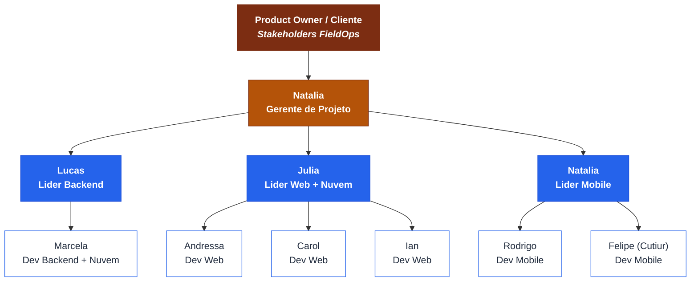

# 🏢 Organograma — Projeto FieldOps

> **Projeto:** FieldOps — Plataforma de Inspeção em Campo
> **Documento:** Organograma (Estrutura Hierárquica e Responsáveis)
> **Disciplina:** Gestão de Projetos — RH e Comunicações
> **Versão:** 1.0

---

## 1. Objetivo

Este documento apresenta a **estrutura hierárquica** do projeto FieldOps e os **principais responsáveis**, no formato gráfico de cima para baixo, conforme a técnica de organograma tradicional. Ele mostra posições, papéis e as relações de subordinação entre os integrantes das áreas de Backend, Web, Mobile e Nuvem/Infraestrutura.

A estrutura reflete a equipe descrita no `README.md` do repositório e a governança definida na EAP (`docs/EAP.md`), em que a **Natália** atua como Gerente do Projeto.

---

## 2. Equipe e papéis

| Integrante | GitHub | Papel no projeto | Área |
|---|---|---|---|
| **Natália** | [@NataliaNogueira1](https://github.com/NataliaNogueira1) | Gerente de Projeto + Desenvolvedora Mobile | Gestão / Mobile |
| **Lucas** | [@lucasmiguelleite](https://github.com/lucasmiguelleite) | Líder Técnico Backend | Backend |
| **Marcela** | [@MarcelaMulato](https://github.com/MarcelaMulato) | Desenvolvedora Backend + Nuvem | Backend / Nuvem |
| **Júlia** | [@JujubsPaes](https://github.com/JujubsPaes) | Desenvolvedora Web + Nuvem | Web / Nuvem |
| **Andressa** | [@DreBartolomeu](https://github.com/DreBartolomeu) | Desenvolvedora Web | Web |
| **Carol** | [@almeida-carol](https://github.com/almeida-carol) | Desenvolvedora Web | Web |
| **Ian** | [@IanLucasss](https://github.com/IanLucasss) | Desenvolvedor Web | Web |
| **Rodrigo** | [@Rodrigof981](https://github.com/Rodrigof981) | Desenvolvedor Mobile | Mobile |
| **Felipe (Cutiur)** | [@Cutiur](https://github.com/Cutiur) | Desenvolvedor Mobile | Mobile |

> **Observação:** por ser um projeto acadêmico com equipe enxuta, alguns integrantes acumulam papéis (ex.: Natália é Gerente e também atua no Mobile; Marcela e Júlia acumulam Nuvem com suas áreas de desenvolvimento).

---

## 3. Organograma (Mermaid)



---

## 4. Descrição das responsabilidades por nível

### 4.1 Product Owner / Cliente (Stakeholders)
Representa as partes interessadas do FieldOps. Define a visão do produto, prioridades de negócio e valida as entregas de valor (aprovação final do MVP).

### 4.2 Gerente de Projeto — Natália
Responsável pela **gestão e planejamento** (EAP, backlog, cronograma), pela coordenação entre as três frentes de desenvolvimento e pela comunicação com os stakeholders. Acompanha desempenho, remove impedimentos e conduz as cerimônias do projeto.

### 4.3 Líderes de área
- **Lucas — Líder Backend:** conduz a API REST (Java + Spring Boot), autenticação, regras de negócio, persistência e sincronização.
- **Júlia — Líder Web + Nuvem:** conduz a interface administrativa (React/Vite) e apoia a infraestrutura/nuvem (ambientes, banco, pipeline).
- **Natália — Líder Mobile:** conduz o aplicativo (Expo/React Native), acumulando com a gerência do projeto.

### 4.4 Desenvolvedores
- **Backend:** Marcela (também Nuvem).
- **Web:** Andressa, Carol e Ian.
- **Mobile:** Rodrigo e Felipe (Cutiur).

---

## 5. Estrutura hierárquica resumida (texto)

```text
Product Owner / Cliente (Stakeholders)
└── Natália — Gerente de Projeto
    ├── Backend
    │   ├── Lucas (Líder Backend)
    │   └── Marcela (Dev Backend + Nuvem)
    ├── Web
    │   ├── Júlia (Líder Web + Nuvem)
    │   ├── Andressa (Dev Web)
    │   ├── Carol (Dev Web)
    │   └── Ian (Dev Web)
    └── Mobile
        ├── Natália (Líder Mobile)
        ├── Rodrigo (Dev Mobile)
        └── Felipe / Cutiur (Dev Mobile)
```
