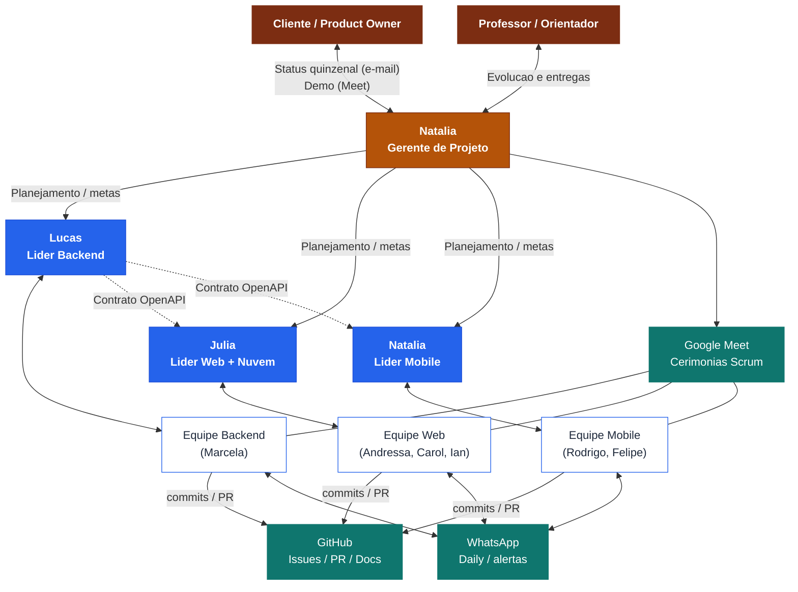

# 📣 Plano de Comunicação — Projeto FieldOps

> **Projeto:** FieldOps — Plataforma de Inspeção em Campo
> **Documento:** Plano de Gerenciamento das Comunicações
> **Disciplina:** Gestão de Projetos — RH e Comunicações
> **Versão:** 1.0

---

## 1. Objetivo

Definir uma abordagem apropriada para as comunicações do projeto FieldOps, com base nas necessidades de informação das partes interessadas. O plano descreve **quais** comunicações ocorrem, **com que frequência**, por **qual canal**, para **qual público**, sob **qual responsável (proprietário)**, em **qual formato** e em **qual momento**.

---

## 2. Partes interessadas (stakeholders)

| Parte interessada | Interesse principal | Canal preferencial |
|---|---|---|
| Cliente / Product Owner | Valor entregue, andamento do MVP | Reunião + e-mail |
| Gerente de Projeto (Natália) | Andamento geral, riscos, impedimentos | Todos |
| Líderes de área (Lucas, Júlia, Natália) | Coordenação técnica entre frentes | Reunião + GitHub |
| Equipe de desenvolvimento | Tarefas, dúvidas técnicas, integração | WhatsApp + GitHub |
| Professor / Orientador | Evolução e entregas acadêmicas | Reunião + repositório |

---

## 3. Plano de Comunicação — FieldOps

| Descrição da comunicação | Frequência | Canal (síncrono/assíncrono) | Público | Proprietário | Formato | Momento |
|---|---|---|---|---|---|---|
| **Daily / alinhamento rápido** | Diária | WhatsApp (assíncrono) / chamada (síncrono) | Equipe de desenvolvimento | Natália (GP) | Mensagem curta: feito / a fazer / impedimentos | Início do dia |
| **Planejamento de Sprint** | A cada sprint | Reunião — Google Meet (síncrono) | Toda a equipe | Natália (GP) | Reunião com backlog e metas da sprint | Início da sprint |
| **Revisão de Sprint (demo)** | A cada sprint | Reunião — Google Meet (síncrono) | Equipe + Cliente/PO + Orientador | Natália (GP) | Demonstração das entregas | Fim da sprint |
| **Retrospectiva** | A cada sprint | Reunião — Google Meet (síncrono) | Equipe de desenvolvimento | Natália (GP) | Discussão: o que manteve/melhorar | Fim da sprint |
| **Coordenação técnica entre áreas** | Semanal | Google Meet / GitHub (síncrono e assíncrono) | Líderes (Backend, Web, Mobile, Nuvem) | Líderes de área | Alinhamento de contratos/integração (API ↔ Web ↔ Mobile) | Meio da semana |
| **Revisão de código (Pull Request)** | Contínua (a cada PR) | GitHub — Pull Requests (assíncrono) | Área responsável + revisores | Autor do PR | Descrição do PR + comentários de review | A cada entrega de código |
| **Acompanhamento do backlog / board** | Contínua | GitHub Issues / Projects (assíncrono) | Toda a equipe | Natália (GP) | Cards (PBIs) com status e responsáveis | Ao longo da sprint |
| **Contrato de API (OpenAPI/Swagger)** | A cada mudança | GitHub + Swagger UI (assíncrono) | Backend, Web, Mobile | Lucas (Líder Backend) | Documentação OpenAPI publicada | A cada alteração de endpoint |
| **Relatório de status ao Cliente/PO** | Quinzenal / por sprint | E-mail (assíncrono) | Cliente / Product Owner | Natália (GP) | Resumo de progresso, riscos e próximos passos | Fim de cada sprint |
| **Comunicação de riscos e impedimentos** | Conforme necessário | WhatsApp / Google Meet (síncrono) | GP + Líderes + envolvidos | Quem identifica o risco | Alerta + plano de ação | Ao surgir o risco |
| **Documentação do projeto (docs/)** | Conforme necessário | Repositório GitHub (assíncrono) | Toda a equipe + Orientador | Autor do documento | Arquivos Markdown versionados | A cada atualização |
| **Entrega final / apresentação do MVP** | Uma vez (marco) | Reunião — presencial/Meet (síncrono) | Cliente/PO + Orientador + Equipe | Natália (GP) | Apresentação + demonstração ponta a ponta | Encerramento do projeto |

---

## 4. Fluxo de comunicação (Mermaid)

---

## 5. Matriz de canais

| Canal | Tipo | Uso principal |
|---|---|---|
| **WhatsApp** | Assíncrono / Síncrono | Comunicação rápida do dia a dia, alertas e impedimentos |
| **Google Meet** | Síncrono | Cerimônias Scrum (planning, review, retro) e alinhamentos |
| **GitHub (Issues/Projects)** | Assíncrono | Backlog, acompanhamento de cards (PBIs) e status |
| **GitHub (Pull Requests)** | Assíncrono | Revisão de código e integração entre áreas |
| **Swagger UI / OpenAPI** | Assíncrono | Contrato da API compartilhado entre Backend, Web e Mobile |
| **E-mail** | Assíncrono | Relatórios de status formais ao Cliente/PO e Orientador |
| **Repositório `docs/`** | Assíncrono | Documentação versionada do projeto |

---

## 6. Diretrizes gerais

- **Fonte única da verdade:** o backlog e o status oficial ficam no **GitHub** (Issues/Projects); decisões técnicas são registradas em **PRs** e na pasta `docs/`.
- **Contratos primeiro:** mudanças de API são comunicadas via **OpenAPI/Swagger** antes de impactar Web e Mobile, evitando retrabalho.
- **Escalada de impedimentos:** dev → líder de área → Gerente de Projeto → Cliente/PO, quando necessário.
- **Transparência com o cliente:** relatórios de status e demonstrações a cada sprint asseguram que as necessidades das partes interessadas sejam atendidas ao longo de todo o ciclo de vida do projeto.
